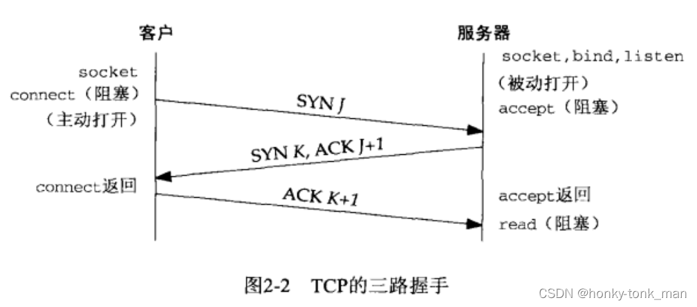
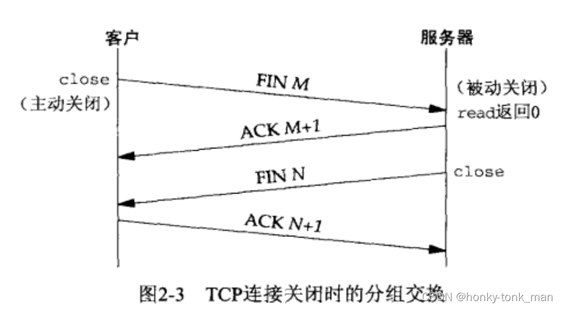
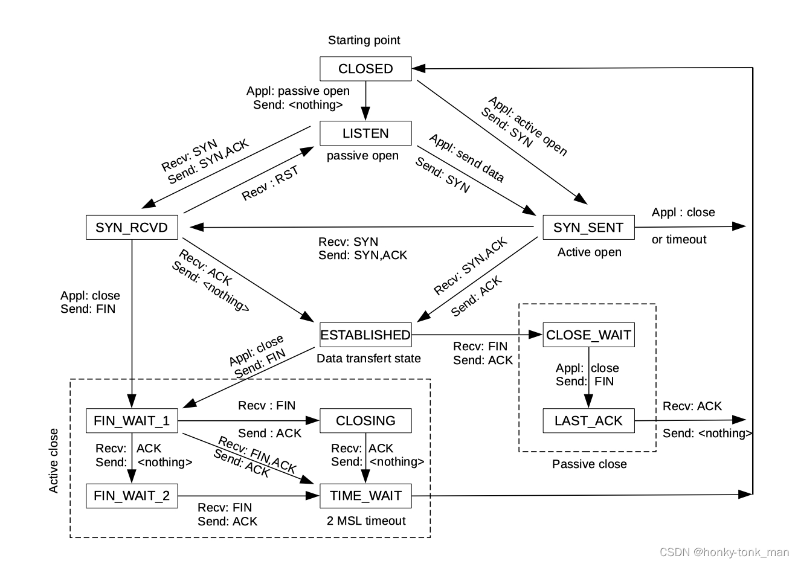
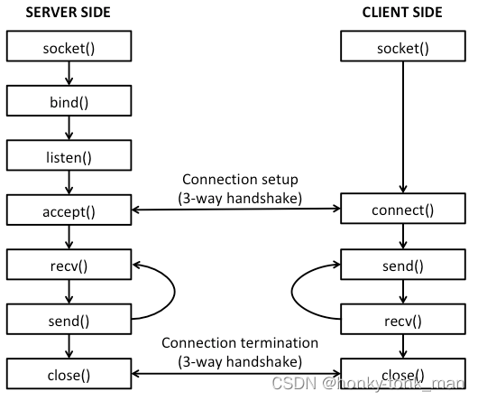
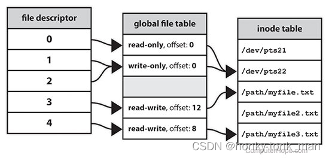
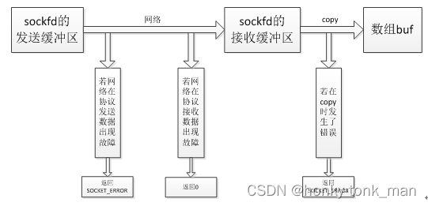
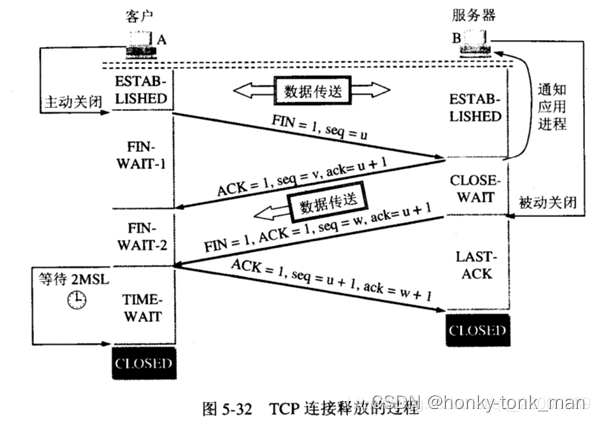

- [c++ Scoket编程](#c-scoket编程)
  - [前言](#前言)
    - [创建socket](#创建socket)
    - [connect服务端](#connect服务端)
    - [传输数据](#传输数据)
    - [bind](#bind)
    - [listen](#listen)
    - [accept](#accept)
    - [设置socket block和no block](#设置socket-block和no-block)
    - [select](#select)
  - [socket编程流程](#socket编程流程)
  - [简单的服务端](#简单的服务端)
  - [简单客户端例子](#简单客户端例子)
    - [上述程序的问题](#上述程序的问题)

# c++ Scoket编程

## 前言
我们都知道socket编程实际上是使用tcp或者udp协议进行消息传输，所以我们要更为的了解tcp/udp协议
tcp三次握手
先看tcp的三次握手示意图  


TCP 状态转换图

linux socket和tcp的关系

linux socket api介绍  
首先我们要先#include头文件，我们进行socket编程先#include <sys/types.h>和#include <sys/socket.h>他们作为socket函数等必要使用的头文件，我们还要一些结构体存储ip地址等等信息，所以我们还要#include <netinet/in.h>  
```
我们编写socket程序要先创建一个socket，socket其实就是一个int
什么是socket？其实socket是一个fd，fd可以说是linux一切皆文件的精髓，linux外部设备可以抽象成fd，比如socket，其本质是网络fd，fd是用户空间和网络空间的一个接口，用户每打开一个文件(unix一切皆文件就会返回一个独一无二的fd),用户看fd就是一个int类型的数字，从内核空间看，我们打开一个文件，回返回一个fd，并且会在global file table中创建一个表项，其每个表项包含此fd的读取限制，偏移量，指向的inode
在这里插入图片描述
```

### 创建socket
我们一般用socket()函数创建socket，使用示例如下

```cpp
socket(DOMAIN, SOCKET_TYPE, PROTOCOL);
```
```
    DOMAIN:指的是我们使用什么协议族，比如UNIX本地传输(AF_UNIX),比如隧道(AF_PPPOX),比如Infiniband(AF_IB),蓝牙(AF_BLUETOOTH),比如IPV4(AF_INET),比如IPV6(AF_INET6)，IPV4，IPV6一般限定在传输层,如果向处理二层等低层次报文我们可以用(AF_PACKET)
    SOCKET_TYPE:指的是我们socket类型(相较于DOMAIN更具体)，我们可以使用tcp/ip类型的socket(SOCK_STREAM),也可以使用UDP(SOCK_DGRAM),也可以使用raw socket，一旦使用raw socket我们就把数据链路层的包头移除自己写(rawsocket一般用于二层网路编程)(SOCK_RAW)
    protocol:protocal一般是指一些socket可以进行特殊的socket配置，如果不进行特殊配置我们就置为0，
```
我们创建一个简单的tcp socket(四层，ip是三层)，然后如下
```cpp
int sock = socket(AF_INET, SOCK_STREAM, 0);
```
因为我们上面创建的tcp socket传输到4层已经没有前面的二层帧头，所以我们为了让我们的socket能处理二层也就是数据链路层的报文，就创建raw socket，如下
```cpp
int sock = socket(AF_PACKET, SOCK_RAW, htons(ETH_P_ALL));
```
ETH_P_ALL是一个宏，代表接收所有二层以太网包

创建ip/port结构
我们要访问对方，要有对方的ip和端口，所以我们要创建地址相关的结构，这个结构就是sockaddr_in
```cpp
struct sockaddr_in server_address;
```
我们设置这个地址的地址组(ipv4)
```cpp
server_address.sin_family = AF_INET;
```
我们设置这个地址的端口
```cpp
server_address.sin_port = htons(9002);
```
设置对端的地址的ip
```cpp
server_address.sin_addr.s_addr = INADDR_ANY;
```
INADDR_ANY是一个宏代表ip是任意ip，一般指的是本机的任意ip

还有一种表示ip的方法是用inet_addr()函数,这个函数输入一个ip地址的字符串(xxx.xxx.xxx.xxx)，然后inet_addr()将这个ip地址的字符串其转换成int类型输出,怎么转换,主要是讲ip地址转换成二进制合并在一起(小端法)，怎么使用这个int类型的ip地址呢?将其转换成16进制,然后每2个16进制位代表一个xxx(因为2个16进制最大ff转换成二进制是255)
### connect服务端
我们知道我们有了socket，有了服务端的地址，我们可以使用connect连接服务端了
connect函数如下
```cpp
connect(SOCKET, ADDR, ADDR_LEN);
```
上述三个参数都好理解，注意的是我们上面第二个参数指的是sockkaddr,我们要将我们的sockaddr_in转换成sockaddr,我们直接根据上述的例子接着写
```cpp
int conn_status = connect(sock, (struct sockaddr* )&server_address, sizeof(server_address));
```
连接可能出错，假如connect返回-1说明连接出错，我们要侦测这个错误,用perror侦测错误码
```cpp
if(conn_status == -1){
	perror("connect error because: ");
	close(sock);
	exit(EXIT_FAILURE);
}
```
### 传输数据
connect成功后我们就已经完成了三次握手，所以此时我们需要的是和服务端传输数据,比如向服务端发送数据，或者从服务端接收数据，我们就假定从服务端接收数据，用recv，接收数据的时候我们要设定接收数据的缓冲区
因为传输中容易出错，而出错后会写入errno中,recv常见的错误如下

```
    发送缓冲区故障和copy的时候出现故障都会返回SOCKET_ERROR,且设置errno
```

我们先看recv函数，recv是block的
```cpp
recv(SOCKET, &BUFFER, BUFFER_LEN, flag);
```
前三个参数都好理解，最后一个flag有啥呢?太多了直接man recv看吧，里面有设置成non-block等等
代码示例如下
```cpp
char recv_buffer[255];
recv(sock, &recv_buffer, stizeof(recv_buffer), 0);
//print recive
printf("the server sent the data is: %s\", recv_buffer);
```
发送数据我们用send
```cpp
send(sockfd, &sendbuf, sendbuflen, flag);
```
### bind
这个用于服务端，将socket和本地地址端口进行bind，以方便后面监听
```cpp
bind(SOCKET, struct sockaddr* ADDR, ADDR_LEN);
```
上面三个参数就不用介绍了吧

### listen
listen后server就监听在这个端口上，这里主要是配置半连接(backlog)等东西
```
    我们的tcp三次握手是由客户端发起的，客户端最开始是CLOSE状态，发送完syn给服务端后，客户端的状态变成SYN_SEND,服务端一开始也是CLOSE状态，收到客户端发送的syn后变成SYN_RECV，服务端在此时会将这个连接放入半连接队列中(syn queue),我们可以通过ss -i查看半连接队列大小， 在服务端将ACK(客户端SYN+1)和服务端的SYN发送给客户端后，客户端接收服务端的ACK(客户端SYN+1)和服务端的SYN发送给客户端后客户端变成ESTABLISH,然后客户端发送ACK(服务端SYN+1)给服务端，服务端收到客户端的ACK后也变成ESTABLISH,并且将这个连接从半连接队列中拿出到全连接队列中
```
listen的函数如下
```cpp
listen(socket, backlog);
```
```
    backlog是个啥？如下
    backlog is the number of connections allowed on the incoming queue. What does that mean? Well, incoming connections are going to wait in this queue until you accept() them
    换句话说我们listen后，linux的tcp/ip协议栈已经开始开始处理tcp连接，等请求到达，服务端后，服务端先缓存起来(缓存到半连接队列,此时服务端的状态是SYN_REVIC),然后进行正常的三次握手，最后都服务端成为ESTABLISH状态后将半连接队列对应的数据移动到全连接队列，最后accpet函数返回一个新的socket给客户端，也就是说我们accept发生在三次握手之后(服务端和客户端都已经成ESTABLISH的状态)，backlog也就是我们的全连接队列大小，我们当然也可以通过设置/proc/sys/net/core/somaxconn，当然这个是设置上限
```
### accept
这个只是将新的socket发送给客户端(连接已经被缓存在全连接队列中)，函数如下
```cpp
accept(sockfd, struct sockaddr*, addrlen)
```
第二个和第三个参数可以为NULL，因为我们可以不用特别指定对端的客户端ip是多少，accept返回客户端的socket
### 设置socket block和no block
```cpp
int fcntl(int fd, int cmd,...);
```
fcnt是设置fd属性的,我们的socket在linux中是一个fd,这是毋庸置疑的,首先设置flag，在设置flag的参数,比如我们可以设置fd的fd flag(F_SETFD)，设置fd的file statue flag(F_SETFL)，比如我们设置fd为no_block如下
```cpp
fcntl(sock, F_SETFL, O_NONBLOCK);
```
我们也可以先将当前fd的flag先取出来再设置
```cpp
int flags = fcntl(fd, F_GETFL, 0);//取出当前的flag
if(flags < 0){ //如果fcntl因为fd或者某些原因出错
	(void)close(fd);
}
flags |= O_NONBLOCK;
```
```
    如果我们将fd设置为非阻塞后，假设数据还没有经过内核到用户空间,此时我们read或者其他方式操作这个noblock的fd，会发生错误(errno),且errno会设置成EAGAIN，意思是等会再试，所以用noblock的时候一般用轮询(while)，但是这样耗费cpu资源
```
### select
select就是选择多个fd进行监听,如果那个fd有情况就返回，select也可以阻塞和非阻塞
```cpp
int select(int nfds, fd_set *readfds, fd_set *writefds,fd_set *exceptfds, struct timeval *timeout);
```
```
    nfd代表我们要监听的fd范围[0,nfd),
    readfds一旦我们的fd集合中有情况可以读这里都会返回
    writefds同上
    exceptfds同上不过这里是如果fd有错误
    timeout因为select会阻塞，这里设置阻塞时间，如果超过这个时间还没有fd有反应就返回
```
```cpp
include <sys/select.h>
#include <stdio.h>
//#include <sys/types.h>

int main(void){
	fd_set rd; //设置fd集合
	struct timeval tv; //设置select阻塞的时间

	FD_ZERO(&rd); //初始化fd集合
	FD_SET(0, &rd); //将我们待监听的fd 0(标准输入)注册到rd这个fd集合中

	tv.tv_sec = 5;  //调用select的时候timeout 5秒,5秒后如果select没有收到任何一个注册的fd数据到达的信号，就退出阻塞
	tv.tv_usec = 0;
	int err = select(1, &rd, NULL, NULL, &tv); //block
	
	if(err == 0){
		printf("select time out!!!\n");
	}else if(err == -1){
		printf("select error!!!\n");
	}else if(err >0){
		printf("select success!!!\n");
	}

	return 0;
}
```
## socket编程流程
**1.** 创建socket套接字  
**2.** 定义服务端地址和端口  
**3.** 服务端绑定地址和端口  
**4.** 服务端进行端口监听  
**5.** 服务端与客户端进行连接  
**6.** 服务端接收客户端发送的信息  
**7.** 服务端返回信息给客户端  
**8.** 关闭套接字

## 简单的服务端
``` cpp
#include <stdio.h>
#include <stdlib.h>
#include <string.h>
#include <unistd.h>
#include <netinet/in.h>
#include <sys/types.h>

#include <errno.h>


int
main(void){
        char send_message[255] = "hello i am server";
        int server_sock = socket(AF_INET, SOCK_STREAM, 0);

        // address
        struct sockaddr_in server_addr;
        server_addr.sin_addr.s_addr = INADDR_ANY;
        server_addr.sin_port = htons(9001);
        server_addr.sin_family = AF_INET; 

        //bind
        if ( (bind(server_sock, (struct sockaddr*) &server_addr, sizeof(server_addr))) != 0 ){
                fprintf(stderr, "couldn't bind: %s\n", strerror(errno));
                exit(EXIT_FAILURE);
        }

        //listen
        if ((listen(server_sock, 10)) != 0){
                fprintf(stderr, "couldn't listen: %s\n", strerror(errno));
                exit(EXIT_FAILURE);
        }

        int client_sock;
        //accept
        if( (client_sock = accept(server_sock, NULL, NULL)) == -1 ){
                fprintf(stderr, "couldn't accept: %s\n", strerror(errno));
                exit(EXIT_FAILURE);
        }

        send(client_sock, send_message, sizeof(send_message), 0);

        close(server_sock);
        close(client_sock);
}
```
## 简单客户端例子
``` cpp
#include <stdio.h>
#include <stdlib.h>
#include <string.h>

#include <sys/types.h>
#include <sys/socket.h>
#include <unistd.h>

#include <netinet/in.h>

#include <errno.h>

int main(void){
        //create sock
        int sock = socket(AF_INET, SOCK_STREAM, 0);
        if(sock < 0){
                fprintf(stderr, "can't create socket because of %s\n", strerror(errno));
                exit(EXIT_FAILURE);
        }

        //create address
        struct sockaddr_in server_addr;
        server_addr.sin_addr.s_addr = INADDR_ANY;
        server_addr.sin_port = htons(9001);
        server_addr.sin_family = AF_INET;

        //connect
        if( (connect(sock, (struct sockaddr*)&server_addr, sizeof(server_addr))) == -1  ){
                perror("connect error because of: ");
                close(sock);
                exit(EXIT_FAILURE);

        }

        //create recv buffer and recv
        char recv_buffer[255];
        recv(sock, recv_buffer, sizeof(recv_buffer), 0);

        //print
        printf("printf recv: %s\n", recv_buffer);

        close(sock);
        return 0;
}
```

### 上述程序的问题

我们的服务端起来后会在accept这里block住，但是当我们crtl + c强制退出的时候，listen的端口还会继续占用
这个可以在我们的状态图中找到答案
首先我们正常的四次挥手是客户端发起的(连接也是客户端发起的)，如下
